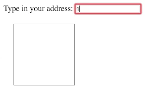

# Address Lookup
A JS extension for awesomplete to query a static server for address suggestions

To test this out:
- Clone repo
- Startup `index.html`
- Type either `111`, `112`, or `113` into the search box
- An attempt to load a `data.json` file from those paths will be made
- If the file is found, then awesomplete will be loaded with a list of suggestions
